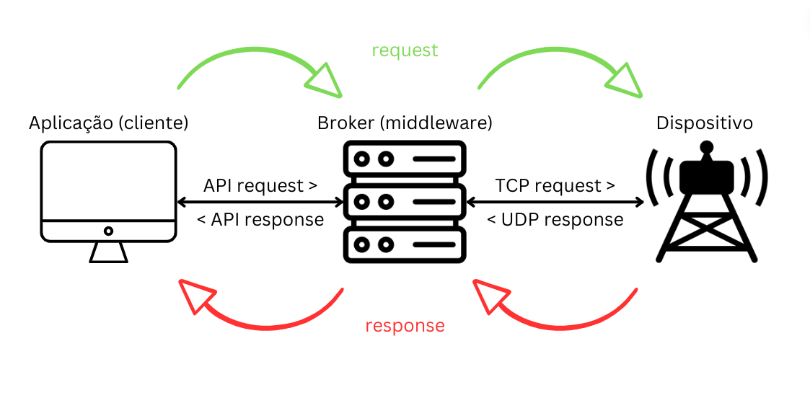
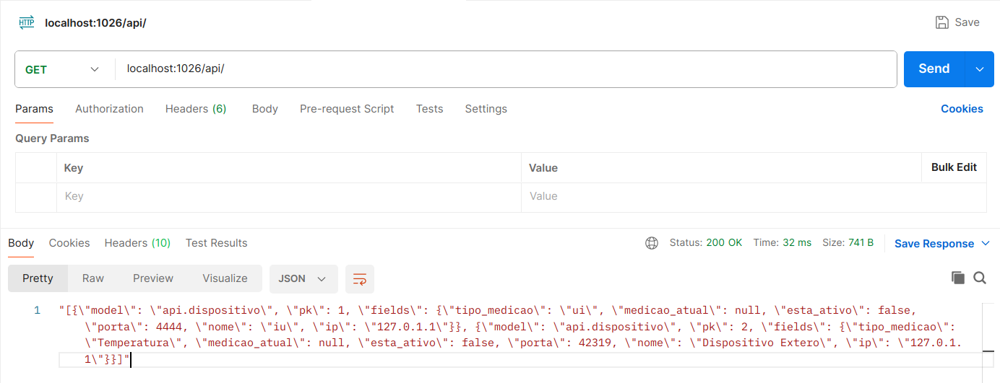
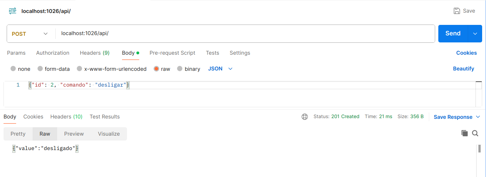
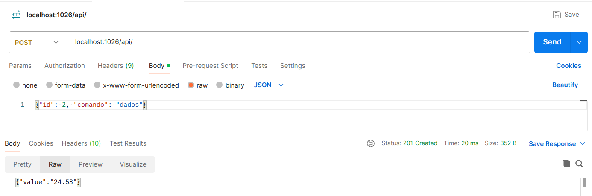
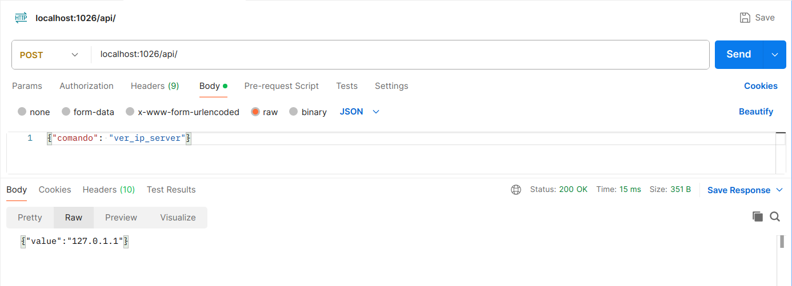

<div align="center">

# Internet of things (IOT)

</div>

# Resumo

<p align="justify">Este relatório aborda a implementação de um Broker utilizando o framework Django, um emulador de dispositivo e uma aplicação, com foco na interconexão desses elementos. O Broker recebe solicitações da aplicação (cliente) por meio de uma API REST e se comunica com os dispositivos através de uma conexão socket TCP. Os dados dos dispositivos são recebidos pelo Broker por meio de uma porta UDP e, em resposta às requisições do cliente, o Broker fornece uma resposta baseada nos dados adquiridos dos dispositivos. Este projeto foi desenvolvido como parte dos estudos da disciplina de Concorrência e Conectividade na Universidade Estadual de Feira de Santana (UEFS).</p>

# Sumário

1. Ferramentas utilizadas;
2. Arquivos principais;
3. Arquitetura da solução (componentes e mensagens);
4. Protocolo de comunicação entre dispositivo e Broker: camada de aplicação e transporte;
5. Interface da Aplicação (REST);
6. Formatacao, envio e tratamento de dados;
7. Tratamento de conexões simultaneas (threads);
8. Gerenciamento do dispositivo;
9. Desempenho (uso de cache no Broker, filas, threads, etc.);
10. Confiabilidade da solução (tratamento das conexões);
11. Emprego do Docker (como executar);

# Ferramentas utilizadas 

- 🔨 Linguagem de Programação Python.
- 🔨 Framework Web Django.
- 🔨 Bibliotecas tkinter, requests, socket, os, queue, threading, time.
- 🔨 Docker
- 🔨 Postman

# Arquivos principais

- Broker: 
    - initialize.py: arquivo responsável por inicializar o servidor Django e o realizar o recebimento de conexões de dispositivos.
    - api/views.py: arquivo responsável pela lógica do back-end da API. Lida com o banco de dados, com as requisições da API e se comunica com os dispositivos.
    - api/scripts/connection_sensor.py: arquivo responsável por obter as funções de comunicação do Broker com os dispositivos.
    - api/buffer/cache.txt: arquivo responsável por guardar as informações de conexões temporárias dos dispositivos.
    - api/models.py: arquivo responsável pela criação da entidade Dispositivo do Banco de Dados.
    - api/urls.py: arquivo de roteamento de urls, que identifica e encaminha para a view correspondente.
- Aplicação: 
    - interface.py: arquivo que contém todas as funções e suas chamadas da aplicação.
- Sensor: 
    - dispositivo.py: arquivo que contém todas as funções e suas chamadas do dispositivo.

# Arquitetura da solução (componentes e mensagens)

<p align="justify">A arquitetura da solução é composta por três principais componentes: o Broker, o emulador de dispositivo e a aplicação cliente.</p>

<p align="justify">Broker: O Broker é o componente central do sistema, responsável por receber requisições da aplicação cliente via API REST (porta 1026). Ele se comunica com os dispositivos por meio de uma conexão socket TCP (porta dinâmica), recebendo dados desses dispositivos através de uma porta UDP (1025). O Broker processa as requisições recebidas, interage com os dispositivos conforme necessário e envia respostas adequadas de volta para a aplicação cliente. Para o dispositivo se conectar pela primeira vez com o Broker, é inserido o IP do servidor Broker e a porta do dispositivo a ser conectado. Além disso, é usado a porta 1028 para realizar a primeira comunicação entre o dispositivo e o Broker. </p>

<p align="justify">O Broker utiliza o Framework Django, escrito em Python, para implementação da API REST. O arquivo broker/api/views.py é responsável por lidar com as requisições e o arquivo broker/api/scripts/connection_sensor.py por fazer as conexões com os dispositivos salvos no Banco de Dados.</p>

<p align="justify">O arquivo broker/api/models.py é uma parte arquitetural do Django que lida com o ORM, com a transcrição de objetos Python em registros no Banco de Dados. A classe Dispositivo é a entidade/tabela do Banco de Dados sqlite3.</p>

<p align="justify">O arquivo broker/initialize.py é o arquivo que inicia o Broker, abrindo duas threads: uma para rodar o servidor web Django e outra para escutar na porta 1028 a conexão de qualquer dispositivo. Quando recebe a conexão, o Broker registra no arquivo broker/api/buffer/cache.txt os dados desse dispositivo. Quando houver uma requisição GET, os dados em cache.txt são salvos no Banco de Dados.</p>

<p align="justify">Emulador de Dispositivo: Este componente simula o comportamento de dispositivos reais no sistema. Ele pode gerar dados de medição aleatórios e responder a comandos enviados pelo Broker. O emulador de dispositivo ajuda no desenvolvimento e teste do sistema, permitindo que diferentes cenários de interação entre dispositivos e o Broker sejam simulados de forma controlada.</p>

<p align="justify">Aplicação Cliente: A aplicação cliente é a interface através da qual os usuários interagem com o sistema. Ela envia requisições ao Broker por meio da API REST, solicitando informações, comandando ações nos dispositivos ou realizando outras operações específicas do sistema. A aplicação cliente recebe as respostas do Broker e apresenta essas informações de forma adequada ao usuário final.</p>

<p align="center">
  
</p>

<p align="justify">As mensagens trocadas entre esses componentes incluem solicitações da aplicação cliente ao Broker, como pedidos de dados de dispositivos ou envio de comandos, mensagens de dados enviadas pelos dispositivos ao Broker, e respostas do Broker para a aplicação cliente, contendo informações solicitadas ou confirmações de ações realizadas. Essa comunicação é fundamental para o funcionamento integrado e eficiente do sistema como um todo.</p>

# Protocolo de comunicação entre dispositivo e Broker 

## Camada de aplicação

<p align="justify">Na camada de aplicação, que atua como a interface para interações entre sistemas via rede, utiliza-se o modelo cliente-servidor para a comunicação eficiente entre o broker e os dispositivos.</p>

<p align="justify">Nesse modelo, o Broker assume o papel de servidor, fornecendo informações para aplicações (servidor HTTP) e dispositivos (servidor UDP). Ele permanece sempre ativo, recebendo solicitações iniciais dos dispositivos e gerenciando as requisições feitas pela interface do usuário, além de encaminhar essas solicitações aos dispositivos e retornar suas respostas. Do lado do dispositivo, ele também é um servidor, mas do tipo TCP, para escutar na porta dinâmica (registrada no momento de ligação do dispositivo) comandos recebidos do Broker.</p>

<p align="justify">Inicialmente, o Dispositivo inicia uma comunicação UDP para estabelecer uma conexão com o Broker, enviando um nome, tipo de medição, porta e seu IP, que serão utilizados posteriormente. Após esse processo, o Dispositivo fica disponível para receber comandos do Broker, como o envio de dados.</p>

<p align="justify">Do outro lado, o Broker recebe a primeira comunicação do dispositivo e registra os dados em uma cache. Quando é feito uma requisição através da API REST, os dados são removidos da cache e salvos no Banco de Dados. Essa foi uma escolha para melhorar o desempenho do servidor. Após salvo o dispositivo, o Broker enviará requisições TCP para o dispositivo com a porta e IP adicionados anteriormente. Essas requisições estarão de acordo com as requisições feitas pelo usuário através da API REST.</p>

## Camada de transporte

<p align="justify">Na camada de transporte, a integração entre os dispositivos e o Broker foi realizada por meio de protocolos específicos, como solicitados no problema inicial. A seguir, descrevo detalhadamente a dinâmica dessa interação entre os dispositivos e o Broker:</p>

### Protocolos de Comunicação:

<p align="justify">O Broker utiliza o protocolo UDP (User Datagram Protocol) para receber dados dos dispositivos, operando em uma porta dedicada (porta 1025). Essa escolha foi feita devido a descrição da atividade proposta e às suas características que resultam em menor sobrecarga, devido a falta de controle de fluxo e retransmissão, o que gera menor tempo de resposta. Os dispositivos emulados transmitem os dados para o Broker por meio dessa porta UDP.</p>

<p align="justify">Quando o Broker necessita estabelecer contato com um dispositivo específico, ele inicia uma conexão TCP (Transmission Control Protocol) com o dispositivo correspondente. Por meio dessa conexão TCP, o Broker envia comandos ou requisita dados ao dispositivo, visto a necessidade de uma abordagem confiável para os comandos de gerenciamento. Ele alcança essa abordagem confiável por meio de técnicas como confirmações de recebimento e retransmissão de dados perdidos, o que garante que comandos e solicitações não sejam perdidos. </p>

# Interface da Aplicação (REST)

<p align="justify">Do lado do cliente, a interface da aplicação baseada em REST é implementada por meio de um código que utiliza a biblioteca tkinter para a criação de uma interface gráfica de usuário (GUI). Esta GUI permite interações com os serviços de rede do sistema, facilitando a comunicação entre o usuário e os dispositivos controlados pelo broker. Quanto às requisições, a interface usa a biblioteca requests para efetuar requisições para a API.</p>

<p align="justify">O código da aplicação define uma classe Application, que herda as funcionalidades da classe tk.Tk do tkinter. Nesta classe, são criados elementos visuais como rótulos, menus, campos de entrada e botões para interação do usuário. Através desses elementos, o usuário pode realizar diversas operações relacionadas aos dispositivos controlados pelo broker.</p>

## Verbos e Rotas na Camada de Aplicação

### 1. Ver dispositivos disponíveis
<p align="justify">Ao selecionar esta opção, a aplicação faz uma requisição GET para a API do broker, obtendo uma lista de dispositivos disponíveis. Essa lista é exibida na interface gráfica para o usuário. Quando essa requisição é feita, os dispositivos salvos em cache são adicionados no Banco de Dados.</p>

- **Verbo**: GET
- **Rota**: `http://localhost:1026/api/`

<p align="center">
  
</p>

### 2. Ligar sensor
<p align="justify">Permite ao usuário enviar um comando para ligar um sensor específico. A aplicação envia uma requisição POST para a API do broker com o ID do dispositivo e o comando "ligar".</p>

- **Verbo**: POST
- **Rota**: `http://localhost:1026/api/`
- **Parâmetros**: `{"id": device_id, "comando": "ligar"}`

<p align="center">
  
</p>

### 3. Desligar sensor
<p align="justify">Similar ao item anterior, porém envia o comando "desligar".</p>

- **Verbo**: POST
- **Rota**: `http://localhost:1026/api/`
- **Parâmetros**: `{"id": device_id, "comando": "desligar"}`

<p align="center">
  
</p>

### 4. Solicitar medição atual do sensor
<p align="justify">Esta opção permite ao usuário solicitar a medição atual de um sensor específico. A aplicação envia uma requisição POST para a API do broker com o ID do dispositivo e o comando "dados". </p>

- **Verbo**: POST
- **Rota**: `http://localhost:1026/api/`
- **Parâmetros**: `{"id": device_id, "comando": "dados"}`

<p align="center">
  
</p>

### 5. Ver IP do servidor (broker)
<p align="justify">Ao selecionar esta opção, a aplicação envia uma requisição POST para a API do broker com o comando "ver_ip_server", obtendo assim o IP do servidor. </p>

- **Verbo**: POST
- **Rota**: `http://localhost:1026/api/`
- **Parâmetros**: `{"comando": "ver_ip_server"}`

<p align="center">
  
</p>

## Interface da Aplicação (REST) do lado do Servidor

### Verbo GET:

Ao receber uma solicitação GET na rota correspondente:
1. O servidor abre e lê um arquivo de cache (`cache.txt`) que contém informações sobre dispositivos.
2. Verifica se há dados no arquivo e, se sim, processa esses dados para criar objetos Dispositivo no banco de dados, evitando duplicação de dispositivos com a mesma porta.
3. Busca todos os dispositivos no banco de dados, serializa-os em formato JSON e retorna essa lista como resposta.

### Verbo POST:

Quando uma solicitação POST é feita na mesma rota:
- Verifica o tipo de comando enviado no corpo da requisição.
- Se o comando for "ver_ip_server", retorna o IP do servidor (broker).
- Caso contrário, acessa os dados enviados para determinar o dispositivo e o comando a ser executado.
- Executa as ações correspondentes no dispositivo com base no comando recebido ("ligar", "desligar", "dados"):
  - Atualiza o status do dispositivo no banco de dados e retorna uma mensagem de confirmação para "ligar" ou "desligar".
  - Obtém a medição atual do dispositivo se o comando for "dados" e o dispositivo estiver ligado. Atualiza o banco de dados com essa medição e a retorna como resposta.

<p align="justify">Essa interface REST fornece endpoints para interagir com os dispositivos, permitindo o controle e a obtenção de informações de forma eficiente e organizada.</p>

<p align="justify">Estas são as operações que a camada de aplicação executa na interação com a API do broker, utilizando os verbos HTTP e as rotas correspondentes para realizar as ações desejadas, como consultar dispositivos disponíveis, controlar sensores e obter informações do servidor (broker).</p>

<p align="justify">A  aplicação também trata possíveis erros de conexão ou respostas inválidas da API, exibindo mensagens de erro na interface gráfica para informar o usuário sobre o problema ocorrido.</p>

# Formatação, envio e tratamento de dados

<p align="justify">O tipo de formatação usado para transmitir os dados nesse projeto é o JSON (JavaScript Object Notation). O JSON é amplamente utilizado devido à sua simplicidade, legibilidade e capacidade de representar estruturas de dados de forma eficiente.</p>

<p align="justify">No JSON, os dados são formatados em pares de chave-valor, onde as chaves são strings que identificam os dados e os valores podem ser de diversos tipos, como strings, números, booleanos, arrays e objetos. Essa estrutura facilita a compreensão e interpretação dos dados por humanos.</p>

<p align="justify">Ao enviar dados por meio de uma requisição HTTP em formato JSON, o servidor e o cliente precisam entender e concordar com a estrutura dos dados para que a comunicação seja bem-sucedida. Isso significa que a aplicação que envia os dados deve garantir que eles estejam formatados corretamente de acordo com as expectativas do receptor.</p>

<p align="justify">No tratamento de dados, tanto o servidor quanto o cliente devem ser capazes de interpretar os dados recebidos em JSON e processá-los adequadamente. Isso envolve validar os dados, realizar operações de acordo com o que foi solicitado na requisição e retornar respostas apropriadas, também em formato JSON, para indicar o resultado da operação.</p>

<p align="justify">Na conexão entre dispositivo e Broker, os dados são trocados em formato Byte do Python. Os dados são enviados como um tipo do Python e é decodificado utilizando a função eval, que identifica o tipo do dado recebido e converte para o tipo equivalente em Python. O Dispositivo, por exemplo, na primeira comunicação com o Broker, envia uma tupla convertida em String: f"('{NOME}', '{MEDICAO}', {TCP_PORT}, '{MEU_IP}')". Do lado do Broker, essa String é convertida novamente em tupla usando a função eval. Isso funciona também para a coleta de dados que o Broker solicita do dispositivo. O dispositivo devolve um Float convertido em String. Na hora do Broker decodificar, essa String retorna a Float. Garantindo que o dado de um lado da comunicação seja enviado com uma formatação X, é garantido que o outro lado da comunicação pode receber um dado com a formatação X. Essa característica torna os diferentes dispostivos comunicáveis entre si.</p>

# Tratamento de conexões simultâneas (threads)

<p align="justify">O código em initialize.py demonstra o tratamento de conexões simultâneas utilizando threads em Python. Aqui está como funciona:</p>

1. Inicialização das Threads:
    - O programa principal (main) inicia duas threads separadas.
    - A primeira thread é responsável por receber informações do dispositivo, simulando um recebimento contínuo de dados via UDP para conexão inicial.
    - A segunda thread é responsável por iniciar o servidor Django, que será executado em paralelo com a thread de recebimento de dados.

2. Recebimento Contínuo de Dispositivos:
    - A função recebe_porta_do_dispositivo é executada em uma thread separada.
    - Dentro dessa função, um socket UDP é criado para aguardar a conexão do dispositivo na porta especificada (UDP_PORT_FIRST_CONNECTION).
    - Quando uma conexão é estabelecida, os dados são recebidos e processados. Em seguida, é criado um socket TCP para enviar uma confirmação de recebimento ao dispositivo.
    - Os dados recebidos são então armazenados em um arquivo cache.txt para posterior processamento pelo Broker.

3. Inicialização do Servidor Django:
    - A função iniciar_servidor_django é responsável por iniciar o servidor Django.
    - Ela executa comandos para fazer as migrações necessárias e iniciar o servidor Django na porta especificada (1026).
    
4. Execução Paralela e Aguardo das Threads:
    - As duas threads (dispositivo_thread e django_thread) são iniciadas em paralelo.
    - O programa principal aguarda o término das threads utilizando o método join(), garantindo que o programa continue em execução até que todas as threads tenham finalizado.
    - Esse modelo de utilização de threads permite que o programa gerencie múltiplas tarefas simultaneamente, como receber dados do dispositivo e atender solicitações da aplicação web, sem bloquear a execução do programa principal. Isso é especialmente útil em situações onde é necessário lidar com operações de entrada e saída (I/O) de forma assíncrona e eficiente.

<p align="justify">As threads foram utilizadas no sistema para torná-lo mais eficiente ao lidar com tarefas simultâneas de forma concorrente. Isso permite que o sistema execute múltiplas operações ao mesmo tempo, como receber dados do dispositivo e atender solicitações da aplicação web, sem a necessidade de esperar uma operação ser concluída para iniciar outra. Isso resulta em uma melhor utilização dos recursos do sistema e melhora a capacidade de resposta em cenários onde múltiplas operações precisam ser realizadas simultaneamente.</p>

<p align="justify">No entanto, o uso de threads pode trazer problemas de concorrência, como condições de corrida e acesso concorrente a recursos compartilhados. No código do uso da thread, é possível identificar uma situação em que esses problemas podem surgir:</p>

- Acesso ao arquivo cache.txt: A função recebe_porta_do_dispositivo escreve dados no arquivo cache.txt enquanto outras threads podem estar acessando ou modificando esse mesmo arquivo. Isso pode levar a condições de corrida e resultados inesperados no conteúdo do arquivo.

<p align="justify">Para lidar com esses problemas de concorrência, a prática do uso de filas e buffers foram aplicadas, já que, ao lidar com múltiplas threads que acessam recursos compartilhados, o uso dessas estratégias podem ajudar a coordenar o acesso aos dados de forma segura e ordenada, evitando problemas de concorrência.</p>

<p align="justify">A estratégia utilizada foi:</p>

- Fila para escrita no arquivo cache.txt: Em vez de escrever diretamente no arquivo cache.txt a partir de várias threads simultaneamente, foi usado uma fila para adicionar os dados a serem escritos. Uma thread dedicada pode então consumir essa fila de forma sequencial, escrevendo os dados no arquivo um após o outro. Isso evita condições de corrida e garante a ordem de escrita.


# Gerenciamento do dispositivo

Sobre o gerenciamento do dispositivo, é possível gerencia-lo por meio da interface do próprio dispositivo, permitindo ações como ligar, desligar, alterar valores da medição atual ou permitir que sejam respondidos valores aleatórios. Essas funcionalidades são implementadas através do menu interativo no arquivo `initialize.py`. Por exemplo:

- **Alterar medição atual:** O usuário pode escolher essa opção no menu e inserir o novo valor da medição atual.
- **Ligar dispositivo:** Ao selecionar essa opção, o dispositivo é ativado e passa a receber comandos do servidor.
- **Desligar dispositivo:** Ao selecionar essa opção, o dispositivo é desativado e para de receber comandos do servidor.
- **Acionar valores aleatórios:** Essa opção faz com que o dispositivo gere valores de medição aleatórios.

Além disso, é possível gerenciar o dispositivo remotamente, como desligar e ligar o dispositivo. Isso é feito através da comunicação com o servidor, onde o servidor envia comandos para ligar ou desligar o dispositivo.

Portanto, tanto a gestão local via interface do próprio dispositivo quanto a gestão remota são implementadas no sistema.

# Desempenho (uso de cache no Broker, filas, threads, etc.)

<p align="justify">O sistema utiliza vários mecanismos para melhorar o desempenho e o tempo de resposta para a aplicação, como:</p>

- Cache no Broker: O sistema utiliza um arquivo de cache (api/buffer/cache.txt) para armazenar temporariamente informações dos dispositivos. Isso evita consultas frequentes ao banco de dados e agiliza o acesso às informações já processadas.

- Filas: A abordagem de recebimento e processamento de mensagens em threads separadas pode ser considerada uma forma de simular uma fila de operações, além do uso da Queue para controlar as operações de escrita no cache. Isso permite lidar com múltiplas conexões simultâneas e processar solicitações de forma mais eficiente.

- Threads: O uso de threads é fundamental para lidar com conexões simultâneas e manter o sistema responsivo. As threads são utilizadas para receber conexões de dispositivos, processar comandos, enviar dados para o broker e gerenciar a interface do dispositivo. No sistema, isso gera um grande desempenho, por permitir que dispositivos se conectem com o Broker sem a necessidade do usuário efetuar essa conexão através do servidor web e que os dispositivos possam escutar as requisições TCP do Broker e permitir a interação com o menu para o gerenciador do dispositivo ao mesmo tempo.

- Protocolos de comunicação eficientes: O sistema utiliza protocolos como TCP e UDP de forma estratégica. O TCP é empregado para garantir a entrega confiável de dados, enquanto o UDP é utilizado para comunicações em tempo real e de baixa latência.

- Optimização de consultas ao banco de dados: Embora não seja obrigatório no projeto, mas uma possibilidade, e não esteja detalhado no código fornecido, é razoável supor que o sistema utilize consultas otimizadas ao banco de dados, como indexação adequada de campos frequentemente acessados, para garantir tempos de resposta rápidos em operações de leitura e escrita.

<p align="justify">Portanto, o sistema adota uma série de práticas e mecanismos para melhorar o desempenho e reduzir o tempo de resposta, garantindo uma experiência eficiente para os usuários da aplicação.</p>

# Confiabilidade da solução (tratamento das conexões)

Supondo a possibilidade de que os 3 nós estão conectados (Broker, dispositivo e aplicação) e que pode haver a remoção e colocação de alguns desses nós do sistema, existem algumas considerações:

1. Se o Broker for desconectado:
    - Nesse caso, utilizando o Docker, quando o servidor Broker é rodado, caso haja a parada e remoção do mesmo, os arquivos desse contêiner serão excluídos. Se um novo Broker for rodado, ou seja, um novo contêiner for criado a partir da imagem carregada, novos arquivos serão carregados. Dentre esses arquivos está o db.sqlite3, que é o Banco de Dados usado nesse projeto. Todos os registros nele feito serão excluídos. Nesse caso, será necessário que os dispositivos sejam conectados novamente ao Broker, ou então será necessário fazer migração de Banco de Dados, ou seja, utilizar uma outra tecnologia que tenha um servidor de Banco de Dados externo, o que não é um requisito para esse projeto. A aplicação não conseguirá se conectar com o servidor, exibindo uma mensagem para o usuário. O dispositivo não conseguirá se conectar inicialmente com o Broker caso ele não esteja ativo. Todos esses comportamentos, são comportamentos esperados.
2. Se o dispositivo for desconectado:
    - Nesse caso, o Broker e a aplicação não serão afetados. Se a aplicação solicitar dados de um dispositivo desconectado, será retornado que o dispositivo está "fora da tomada", fazendo uma analogia a sua remoção. Se esse dispositivo for colocado novamente no sistema, a interface do dispositivo pergunta se o dispositivo já foi conectado ao Broker. Se sim, não haverá problema caso seja inserido a mesma porta que foi adicionado a esse dispositivo quando ele foi conectado ao Broker.
3. Se a aplicação for desconectada:
    - Nesse caso, nem o Broker e nem o dispositivo serão afetados. Ao conectar novamente, o usuário ainda poderá fazer as requisições sem problemas para o Broker.

# Conclusão

O sistema atende aos requisitos estabelecidos ao empregar protocolos de comunicação específicos para cada contexto. Utilizando uma API REST com o protocolo HTTP, os clientes podem se comunicar eficientemente com o Broker. Além disso, a aplicação faz uso dos protocolos UDP e TCP/IP para garantir a comunicação confiável entre o broker e os dispositivos.

Em relação a possíveis falhas de rede que possam afetar a comunicação, o sistema é capaz de lidar com essas situações. Por exemplo, se houver uma desconexão do cabo de rede, o sistema permanece em espera até que a conexão seja restabelecida, assegurando a continuidade das comunicações sem interrupções.

# Emprego do Docker (como executar)

Siga os seguintes passos no terminal para executar o broker: 
- ```git clone https://github.com/douglasojesus/internet-of-things```
- ```cd internet-of-things/broker/```
- ```docker build -t broker .```
- ```docker run --network='host' -it --name container_broker broker```

Com isso, o servidor Broker já está rodando na porta 1026.

Para emular o dispositivo, abra outro terminal e navegue no diretório clonado:
- ```cd internet-of-things/sensor/```
- ```docker build -t sensor .```
- ```docker run --network='host' -it --name container_sensor sensor```

Para exibir a aplicação, abra outro terminal e navegue no diretório clonado:
- ```cd internet-of-things/aplicacao/```
- ```docker build -t aplicacao .```
- ```docker run --network='host' -it -u=$(id -u $USER):$(id -g $USER) -e DISPLAY=$DISPLAY -v /tmp/.X11-unix:/tmp/.X11-unix:rw -v --rm aplicacao```

Se você não conseguir se conectar com o Display, pode usar a aplicação CLI:
- ```cd internet-of-things/aplicacao-cli/```
- ```docker build -t aplicacaocli .```
- ```docker run --network='host' -it --name container_aplicacaocli aplicacaocli```

Se quiser testar a API independente da aplicação, execute no terminal:
- ```curl http://localhost:1026/api/```
- ```curl -X POST http://localhost:1026/api/ -H "Content-Type: application/json" -d '{"id": 1, "comando": "dados"}'```

Método GET retorna todos dispositivos cadastrados.
Comandos disponíveis para método POST: ligar, desligar, dados.

